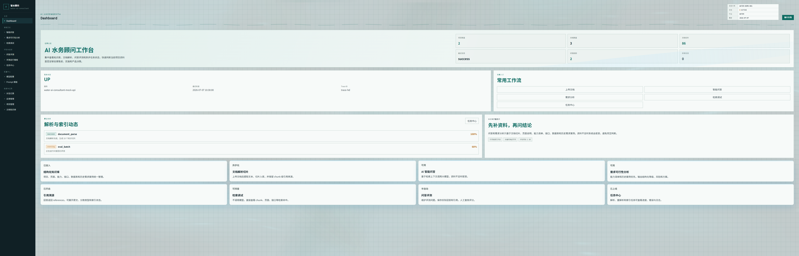
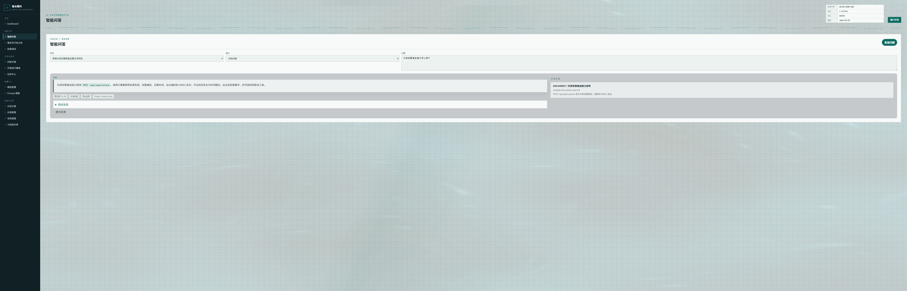
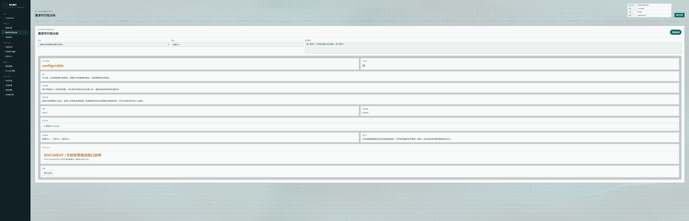
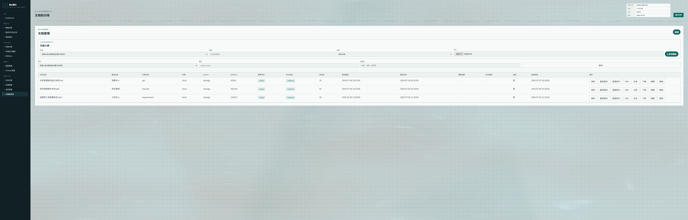
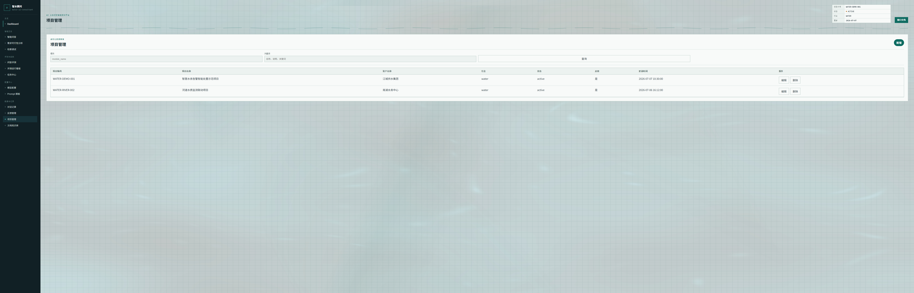
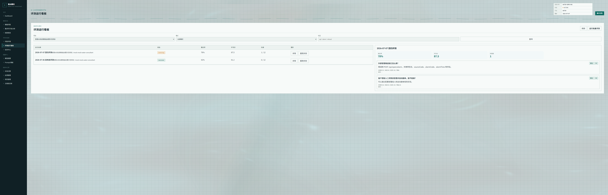

# AI 水务项目智能顾问平台

`water-ai-consultant` 是一个面向水务行业内部团队的智能顾问系统，服务对象包括售前、产品、实施、开发和运维人员。它不是对外市民客服，也不是单纯文档问答机器人，而是围绕项目资料、页面操作、系统能力、接口、数据库说明和历史需求案例形成的内部知识与决策辅助平台。

## 界面预览

<table>
  <tr>
    <td width="50%">
      <strong>Dashboard 总览</strong><br />
      
    </td>
    <td width="50%">
      <strong>智能问答结果</strong><br />
      
    </td>
  </tr>
  <tr>
    <td width="50%">
      <strong>需求可行性分析</strong><br />
      
    </td>
    <td width="50%">
      <strong>文档知识库</strong><br />
      
    </td>
  </tr>
  <tr>
    <td width="50%">
      <strong>项目管理</strong><br />
      
    </td>
    <td width="50%">
      <strong>评测运行看板</strong><br />
      
    </td>
  </tr>
</table>

## 核心能力

- 项目文档知识库
- 文档上传、Apache Tika 解析、切片入库
- 智能问答 `POST /api/chat`
- 需求可行性分析 `POST /api/requirements/check`
- 回答引用溯源和引用详情展开
- 检索调试 `POST /api/search/debug`
- 问答评测和自动评分评测
- 评测运行看板和回归测试
- 文档异步解析任务中心
- 对话记录、反馈管理、反馈转知识库
- 模型配置管理
- Prompt 模板管理
- 本地文件存储 / MinIO 对象存储
- DeepSeek 真实模型调用，Mock LLM 兜底

## 技术栈

- 后端：Spring Boot 3、Java 21、Spring JDBC、Springdoc OpenAPI
- 前端：Vue 3、Vite、TypeScript、Nginx
- 数据库：PostgreSQL
- 文档解析：Apache Tika
- 文件存储：本地 storage / MinIO
- 大模型：DeepSeek / Mock LLM
- 部署：Docker Compose

## 系统架构

```text
Browser
  |
  |  http://127.0.0.1:3000
  v
Nginx + Vue dist
  |
  |  /api, /swagger-ui, /v3/api-docs
  v
Spring Boot API
  |------------------ storage/ 或 MinIO
  |------------------ Apache Tika
  |------------------ Mock LLM / DeepSeek
  v
PostgreSQL
```

## 快速启动

准备 Docker 和 Docker Compose 后执行：

```bash
cp .env.example .env
docker compose up -d --build
```

默认使用 `LLM_PROVIDER=mock`，不需要任何真实 API Key。

访问地址：

- 前端：[http://127.0.0.1:3000](http://127.0.0.1:3000/)
- 后端：[http://127.0.0.1:8080](http://127.0.0.1:8080/)
- Swagger：[http://127.0.0.1:8080/swagger-ui/index.html](http://127.0.0.1:8080/swagger-ui/index.html)

健康检查：

```bash
curl http://127.0.0.1:8080/api/health
```

停止：

```bash
docker compose down
```

清空数据库 volume 后重新初始化：

```bash
docker compose down -v
docker compose up -d --build
```

## DeepSeek 配置

复制 `.env.example` 为 `.env` 后修改：

```env
LLM_PROVIDER=deepseek
DEEPSEEK_API_KEY=你的 DeepSeek API Key
DEEPSEEK_BASE_URL=https://api.deepseek.com
DEEPSEEK_MODEL=deepseek-v4-flash
```

没有 API Key 时保持：

```env
LLM_PROVIDER=mock
```

Mock 模型只用于本地演示和流程联调，不代表真实问答质量。

## 本地开发启动

数据库初始化：

```bash
createdb water_ai_consultant
psql -U postgres -d water_ai_consultant -f database/init.sql
```

后端：

```bash
cd backend
mvn spring-boot:run
```

如本地数据库密码不是默认值：

```bash
set DB_URL=jdbc:postgresql://127.0.0.1:5432/water_ai_consultant
set DB_USERNAME=postgres
set DB_PASSWORD=你的密码
mvn spring-boot:run
```

前端：

```bash
cd frontend
npm install
npm run dev -- --host 127.0.0.1 --port 3000
```

## 演示流程

1. 打开“项目管理”，查看示例项目“智慧水务告警智能处置示范项目”。
2. 打开“文档知识库”，上传 `sample-docs/` 里的示例文档并触发解析。
3. 打开“智能问答”，提问：`外部告警推送接口怎么用？`
4. 打开“需求可行性分析”，输入：`客户想接入二供泵房告警并自动建单，能不能做？`
5. 打开“问答评测”，批量运行评测，再到“评测运行看板”查看自动评分结果。

## 目录结构

```text
water-ai-consultant/
  backend/                 Spring Boot 后端
  frontend/                Vue 3 + Vite 前端
  database/                本地数据库初始化 SQL
  docker/
    postgres/
      init.sql             Docker PostgreSQL schema 初始化
      seed-demo.sql        公开演示数据
  docs/                    使用、配置、架构和 API 文档
  sample-docs/             可公开的示例文档
  storage/                 本地文件存储目录，仅保留 .gitkeep
  MinIO                    Docker Compose 可选对象存储，用于保存文档原文件
  docker-compose.yml       一键启动编排
  .env.example             环境变量模板
```

## 数据库说明

核心表包括：

- `ai_project`：水务客户项目
- `ai_document`：项目文档
- `ai_document_chunk`：文档切片和引用来源
- `ai_page`：页面操作说明
- `ai_capability`：系统能力清单
- `ai_api`：接口说明
- `ai_db_table`：数据库表说明
- `ai_requirement_case`：历史需求案例
- `ai_chat_session`、`ai_chat_message`：对话记录
- `ai_answer_reference`：回答引用来源
- `ai_feedback`、`ai_faq`：反馈与知识沉淀
- `ai_task`、`ai_task_log`：异步任务和日志
- `ai_model_config`、`ai_prompt_template`：模型和 Prompt 配置
- `ai_eval_case`、`ai_eval_result`、`ai_eval_run`：评测、自动评分和回归看板

Docker 首次启动会执行：

- `docker/postgres/init.sql`
- `docker/postgres/seed-demo.sql`

## 常见问题

### 没有 DeepSeek Key 能启动吗？

可以。默认 `.env.example` 使用 `LLM_PROVIDER=mock`，完整流程可启动和演示。

### 修改 seed SQL 后为什么没生效？

PostgreSQL 官方镜像只在数据目录为空时执行 `/docker-entrypoint-initdb.d`。请执行：

```bash
docker compose down -v
docker compose up -d --build
```

### 前端请求 API 404 怎么办？

Docker 环境下前端由 Nginx 托管，`/api` 会反向代理到后端容器。请确认：

```bash
docker compose ps
curl http://127.0.0.1:8080/api/health
```

### storage 目录会提交文件吗？

不会。`.gitignore` 忽略 `storage/*`，只保留 `storage/.gitkeep`。

### 如何启用 MinIO？

`.env` 中设置：

```env
STORAGE_TYPE=minio
MINIO_ENDPOINT=http://minio:9000
MINIO_ACCESS_KEY=minioadmin
MINIO_SECRET_KEY=minioadmin
MINIO_BUCKET=water-ai-consultant
```

然后执行：

```bash
docker compose up -d --build
```

MinIO 控制台地址为 [http://127.0.0.1:9001](http://127.0.0.1:9001/)。MinIO 用于保存上传的文档原文件，文档切片、引用来源、索引状态仍保存在 PostgreSQL。

## 后续规划

- pgvector 真向量检索增强和索引调优
- MinIO 生产化参数和文件预览
- 用户登录与权限
- 多项目权限隔离
- 更完整的生产部署配置
- 异步评测任务和批量任务取消

## 许可证

当前仓库未指定许可证。发布到 GitHub 前请根据团队要求补充 `LICENSE`。
