# AI 水务项目智能顾问平台面试准备文档

> 文档用途：快速熟悉 `water-ai-consultant` 项目，准备面试讲解。内容基于当前代码、README、数据库初始化脚本、后端接口、前端页面和 Docker 配置整理。

## 目录

1. [项目一句话介绍](#1-项目一句话介绍)
2. [项目背景](#2-项目背景)
3. [项目整体架构](#3-项目整体架构)
4. [核心业务流程图](#4-核心业务流程图)
5. [技术栈说明](#5-技术栈说明)
6. [核心数据库表说明](#6-核心数据库表说明)
7. [核心接口说明](#7-核心接口说明)
8. [核心功能讲解](#8-核心功能讲解)
9. [项目亮点](#9-项目亮点)
10. [项目难点与解决方案](#10-项目难点与解决方案)
11. [项目不足与后续优化](#11-项目不足与后续优化)
12. [简历项目描述](#12-简历项目描述)
13. [1 分钟面试介绍](#13-1-分钟面试介绍)
14. [3 分钟面试介绍](#14-3-分钟面试介绍)
15. [5 分钟深度讲解](#15-5-分钟深度讲解)
16. [高频面试追问与回答](#16-高频面试追问与回答)
17. [STAR 项目难点表达](#17-star-项目难点表达)
18. [面试快速复习清单](#18-面试快速复习清单)
19. [Mermaid 图汇总](#19-mermaid-图汇总)
20. [整理依据](#20-整理依据)

## 1. 项目一句话介绍

`water-ai-consultant` 是一个面向水务行业售前、产品、实施、开发和运维人员的内部 AI 项目智能顾问平台。它把项目文档、页面操作说明、能力清单、接口说明、数据库说明和历史需求案例统一检索，用于项目问答、需求可行性判断、引用溯源、问答评测和反馈知识沉淀。

## 2. 项目背景

### 2.1 为什么水务行业需要这个项目

水务项目通常具有定制化强、实施周期长、系统模块多、交付资料分散的特点。一个项目里可能同时涉及告警、工单、巡检、设备、管网、水质、接口对接和数据表设计。售前、产品、实施和开发在回答客户问题时，经常需要翻项目文档、查接口说明、找历史需求案例，再结合个人经验判断能不能做。

这个项目的目标不是替代业务专家，而是把分散资料变成可检索、可引用、可评测的项目知识底座，让团队在回答问题和判断需求时有依据。

### 2.2 水务定制化项目中的常见痛点

1. 文档分散：项目方案、操作说明、接口文档、数据库说明散落在不同目录或人员手里。
2. 历史需求难复用：类似客户需求做过，但新项目成员不知道已有案例。
3. 页面操作靠人传：实施和运维经常被问某个页面在哪里、某个功能怎么配置。
4. 可行性判断依赖经验：客户提出新需求时，售前需要快速判断是已有功能、配置支持还是二开。
5. 回答缺少证据：普通问答容易只给结论，无法说明依据来自哪份文档、哪个页面或哪个接口。
6. 资料不足时容易误答：大模型如果没有约束，可能把相似知识扩展成“已支持”。

### 2.3 为什么不是普通客服机器人

普通客服机器人通常面向外部用户，解决高频咨询、工单分流和标准话术问题。这个项目面向内部团队，问题更偏项目交付和技术决策，例如：

- 某个项目是否支持外部告警推送。
- 某个页面如何操作。
- 某个字段属于哪张业务表。
- 客户提出“二供泵房告警接入并自动建单”是否可做。

因此它更像“项目顾问”，不仅回答是什么，还要给出依据、风险、影响模块、相关接口和历史案例。

### 2.4 和普通 RAG 知识库的区别

普通 RAG 通常只做文档切片、检索、拼 Prompt、调用模型。本项目在 RAG 基础上增加了结构化知识和工程闭环：

- 不只检索文档 chunk，还检索页面说明、能力清单、接口说明、数据表说明、历史需求案例。
- 需求可行性分析有固定优先级和规则护栏，能力清单和历史需求案例优先。
- 无依据时返回固定拒答，不能让模型自由发挥。
- 每次回答保存会话、消息、引用来源，前端可以查看引用详情。
- 提供检索调试页，排查“解析、切片、检索、Prompt、模型”哪一层出问题。
- 提供问答评测、自动评分、评测运行看板和反馈转知识库闭环。

## 3. 项目整体架构

项目采用前后端分离架构。前端是 Vue 3 + Vite 管理后台，后端是 Spring Boot + Spring AI REST API，数据库使用 PostgreSQL。文档上传后保存到本地 `storage/` 或 MinIO，通过 Apache Tika 提取文本并切片。问答时先检索结构化知识和文档 chunk，将证据转换为 Spring AI Document，再通过 PromptTemplate、ChatClient 和结构化输出调用 DeepSeek，最终保存会话、消息和引用。

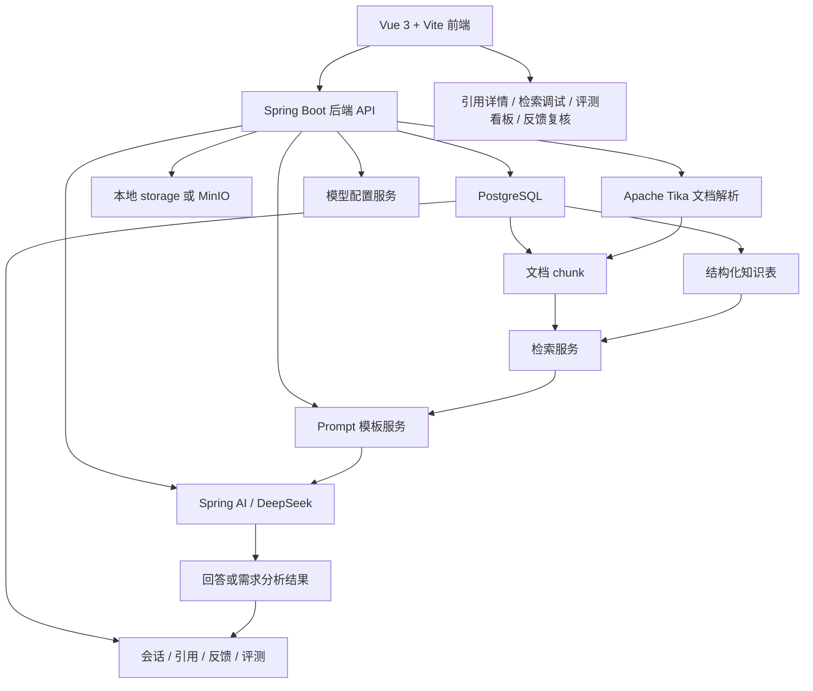

## 4. 核心业务流程图

### 4.1 文档上传解析流程

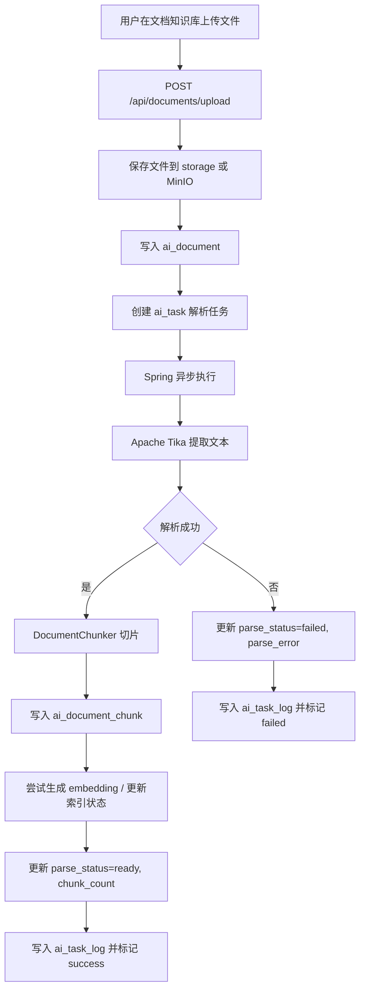

### 4.2 智能问答流程

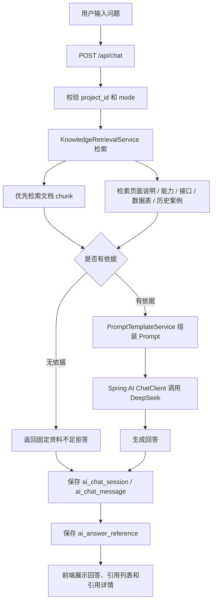

### 4.3 需求可行性分析流程

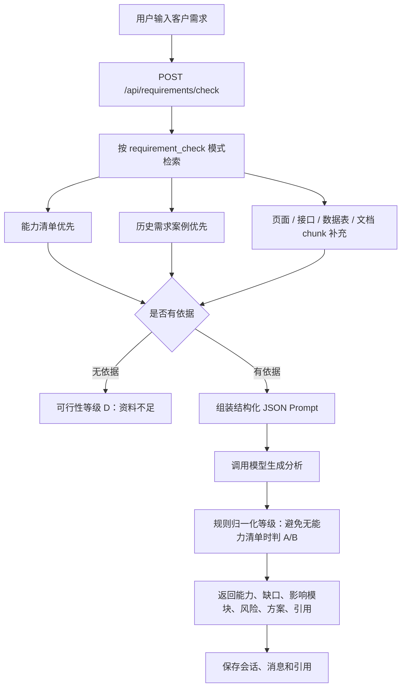

### 4.4 反馈转知识库流程

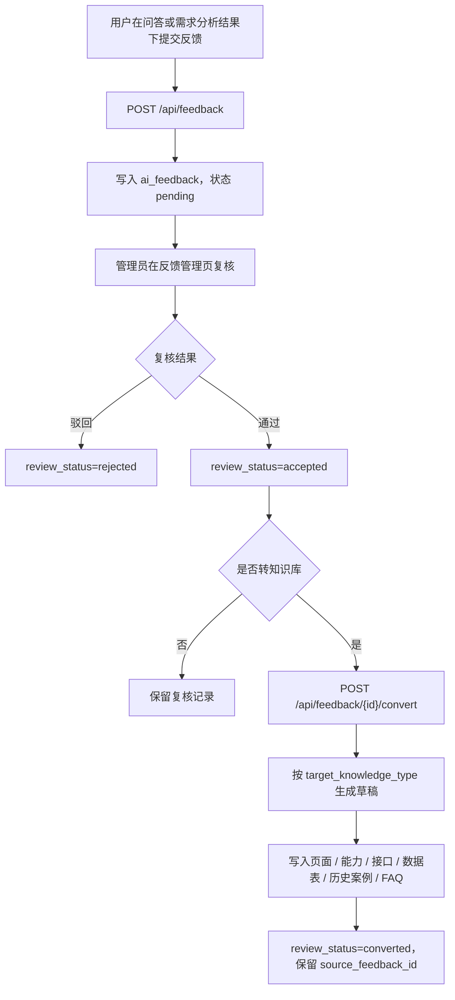

### 4.5 问答评测和自动评分流程

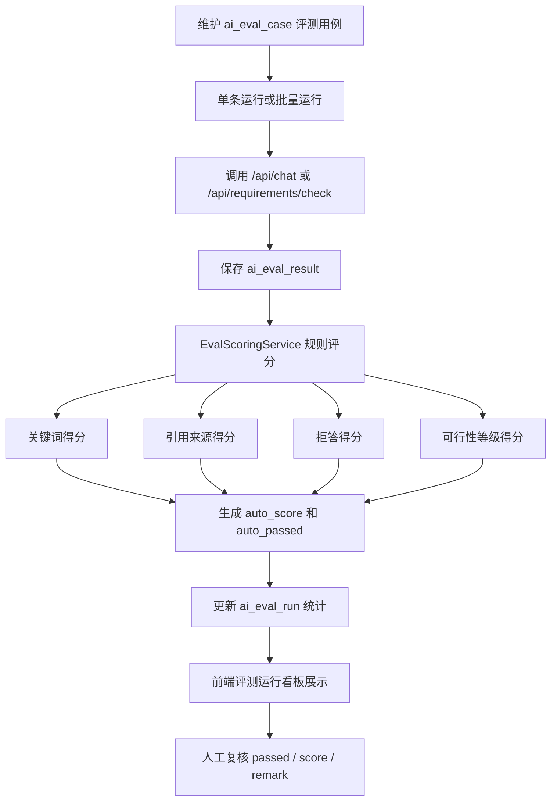

## 5. 技术栈说明

| 层级 | 技术 | 作用 |
| --- | --- | --- |
| 后端 | Spring Boot 3.5 + Spring AI 1.1 + Java 21 | 提供 REST API、AI 编排、统一响应、异常处理和异步任务 |
| 后端数据访问 | Spring JDBC | 直接操作 PostgreSQL，便于控制 SQL、JSONB、pgvector 相关字段 |
| 前端 | Vue 3 + Vite + TypeScript | 管理后台、问答页面、评测看板、反馈复核和任务中心 |
| 数据库 | PostgreSQL | 存储结构化知识、文档 chunk、对话、引用、反馈、评测和配置 |
| 文档解析 | Apache Tika | 从上传文件中提取文本内容，供切片和检索使用 |
| 检索 | 关键词检索 + pgvector 可选 | 文档 chunk 优先，结构化知识补充；向量不可用时降级关键词 |
| 大模型 | Spring AI ChatClient + DeepSeek | 通过 OpenAI 兼容协议执行真实问答，不提供生产 Mock LLM |
| Embedding | Spring AI EmbeddingModel | 真实 embedding 可配置；未配置时自动降级关键词检索 |
| 文件存储 | 本地 storage / MinIO | 保存上传原文件；当前 Docker Compose 已提供 MinIO 服务，默认仍可用本地存储 |
| 部署 | Docker Compose + Nginx | PostgreSQL、后端、前端和 MinIO 一键启动，前端 Nginx 代理 `/api` |
| API 文档 | Springdoc OpenAPI | 通过 Swagger UI 验证接口 |

## 6. 核心数据库表说明

### 6.1 项目和知识库表

| 表 | 作用 | 为什么需要 | 使用流程 |
| --- | --- | --- | --- |
| `ai_project` | 维护水务客户项目 | 所有知识、文档、问答和评测都按项目隔离 | 项目管理、问答、需求分析、评测筛选 |
| `ai_document` | 维护项目文档元数据 | 记录文件路径、存储方式、解析状态、索引状态和 chunk 数 | 文档上传、解析任务、文档列表 |
| `ai_document_chunk` | 保存文档切片 | RAG 检索最小粒度，保留文档标题、chunk 序号、页码、章节和索引状态 | 文档解析、问答检索、引用溯源 |
| `ai_page` | 保存页面操作说明 | 页面类问题需要优先从页面说明找依据 | 页面操作说明管理、`page_help` 问答、反馈转知识 |
| `ai_capability` | 保存系统能力清单 | 判断“是否支持、是否配置即可支持”的核心依据 | 需求可行性分析、业务问答、反馈转知识 |
| `ai_api` | 保存接口说明 | 接口接入问题需要路径、方法、请求和响应说明 | 接口说明管理、接口类问答、需求分析 |
| `ai_db_table` | 保存数据库表说明 | 字段、表关系、数据落库问题需要结构化依据 | 数据表说明管理、数据库字段类问答 |
| `ai_requirement_case` | 保存历史需求案例 | 复用历史方案和风险判断 | 需求可行性分析、历史经验复用、反馈转知识 |
| `ai_faq` | 保存反馈转成的 FAQ 草稿 | `document_faq` 类型反馈需要可落库承接 | 反馈转知识库；当前主要作为沉淀表，未做独立菜单 |

### 6.2 异步任务表

| 表 | 作用 | 为什么需要 | 使用流程 |
| --- | --- | --- | --- |
| `ai_task` | 记录解析、重解析、索引、批量索引任务 | 文档解析和索引可能耗时，接口不能长期阻塞 | 上传解析、重新解析、重建索引、任务中心 |
| `ai_task_log` | 记录任务日志 | 失败时能看到阶段、错误信息和进度 | 任务详情、任务日志、失败重试 |

### 6.3 问答和反馈表

| 表 | 作用 | 为什么需要 | 使用流程 |
| --- | --- | --- | --- |
| `ai_chat_session` | 保存一次问答会话 | 支持对话记录列表、按项目和模式筛选 | `/api/chat`、`/api/requirements/check`、对话记录页 |
| `ai_chat_message` | 保存用户问题和 AI 回答 | 保存 trace_id、模型、Prompt 模板、检索策略、是否拒答 | 对话详情、反馈入口、评测结果追溯 |
| `ai_answer_reference` | 保存回答引用来源 | 每个回答必须可追溯来源，降低幻觉 | 引用详情弹窗、对话详情、反馈复核 |
| `ai_feedback` | 保存用户反馈和复核状态 | 把错误回答、缺失信息和修正答案纳入流程 | 问答反馈、反馈管理、反馈转知识库 |

### 6.4 评测和配置表

| 表 | 作用 | 为什么需要 | 使用流程 |
| --- | --- | --- | --- |
| `ai_eval_case` | 保存评测用例 | 固化高频问题、拒答用例和需求分析用例 | 问答评测页、批量回归 |
| `ai_eval_result` | 保存每次评测实际结果 | 记录实际回答、引用、得分、人工复核 | 自动评分、结果复核 |
| `ai_eval_run` | 保存批量评测运行 | 汇总成功数、失败数、平均分、通过率 | 评测运行看板、失败重跑 |
| `ai_model_config` | 保存模型配置 | 避免模型 provider、base_url、Key、模型名写死在代码里 | 模型配置页、运行时模型选择、连接测试 |
| `ai_prompt_template` | 保存 Prompt 模板 | 支持不同 mode 的 Prompt 调整和测试 | Prompt 模板页、问答和需求分析渲染 |

## 7. 核心接口说明

### 7.1 健康检查

| 接口 | 用途 | 输入核心参数 | 输出核心字段 | 面试解释 |
| --- | --- | --- | --- | --- |
| `GET /api/health` | 检查后端服务是否可用 | 无 | 状态、应用名、时间等 | Docker 和本地启动后用它验证 Spring Boot 已启动 |

### 7.2 结构化资料 CRUD

| 接口 | 用途 | 输入核心参数 | 输出核心字段 | 面试解释 |
| --- | --- | --- | --- | --- |
| `/api/projects` | 项目 CRUD | `project_id`、`module_name`、`keyword` 查询；新增/更新传项目字段 | 项目记录 | 项目是所有知识的隔离维度 |
| `/api/documents` | 文档元数据 CRUD | `project_id`、`module_name`、`keyword` | 文档记录、解析状态、索引状态 | 与上传解析接口配合管理文档 |
| `/api/pages` | 页面说明 CRUD | 页面名、模块、路径、操作说明 | 页面说明记录 | 页面操作类问题优先查它 |
| `/api/capabilities` | 能力清单 CRUD | 能力名、模块、支持等级、限制 | 能力记录 | 需求分析判断 A/B/C 的关键依据 |
| `/api/apis` | 接口说明 CRUD | 接口名、方法、路径、请求/响应说明 | 接口记录 | 接口接入类问题优先查它 |
| `/api/db-tables` | 数据表说明 CRUD | 表名、字段 JSON、关系说明 | 数据表记录 | 数据字段类问题优先查它 |
| `/api/requirement-cases` | 历史需求案例 CRUD | 需求描述、方案、等级、风险 | 案例记录 | 需求分析复用历史经验 |

### 7.3 文档处理

| 接口 | 用途 | 输入核心参数 | 输出核心字段 | 面试解释 |
| --- | --- | --- | --- | --- |
| `POST /api/documents/upload` | 上传文档并创建解析任务 | `project_id`、`module_name`、`document_type`、`file` | 文档记录、`task_id` | 上传后不阻塞等待解析，交给任务中心异步处理 |
| `POST /api/documents/{id}/parse` | 重新解析文档 | 文档 ID | `task_id`、任务状态 | 适合文档内容更新后重跑解析 |
| `POST /api/documents/{id}/reindex` | 重建指定文档索引 | 文档 ID | `task_id` | embedding 或向量索引配置变化后重建 |
| `POST /api/documents/reindex-all` | 批量重建索引 | 无 | `task_id` | 用于批量刷新已解析文档索引 |
| `GET /api/documents/{id}/chunks` | 查看文档切片 | 文档 ID | chunk 列表、内容、序号、来源信息 | 排查切片质量和引用定位 |
| `GET /api/documents/{id}/download` | 下载原文件 | 文档 ID | 文件流 | 保留原始资料可追溯 |

### 7.4 AI 问答和需求分析

| 接口 | 用途 | 输入核心参数 | 输出核心字段 | 面试解释 |
| --- | --- | --- | --- | --- |
| `POST /api/chat` | 智能问答 | `project_id`、`mode`、`question` | `answer`、`references`、相关页面/能力/API、`confidence`、`trace_id`、模型和检索策略 | RAG 主入口，支持文档问答、页面帮助、业务问答和需求初判 |
| `POST /api/requirements/check` | 需求可行性分析 | `project_id`、`requirement_desc`、`module_name` | 理解、等级、结论、能力、缺口、风险、方案、引用 | 对客户新需求做结构化判断，能力清单和历史案例优先 |
| `POST /api/search/debug` | 检索调试 | `project_id`、`question`、`mode`、`top_k` | 检索策略、chunk 命中、结构化知识命中、分数 | 不调用模型，用于排查回答不准是不是检索问题 |

### 7.5 任务中心

| 接口 | 用途 | 输入核心参数 | 输出核心字段 | 面试解释 |
| --- | --- | --- | --- | --- |
| `GET /api/tasks` | 任务列表 | `task_type`、`status`、`biz_id` | 任务状态、进度、消息、时间 | 展示解析/索引任务运行情况 |
| `GET /api/tasks/{id}` | 任务详情 | 任务 ID | 任务详情 | 前端轮询查看进度 |
| `GET /api/tasks/{id}/logs` | 任务日志 | 任务 ID | 日志级别、消息、时间 | 定位解析或索引失败原因 |
| `POST /api/tasks/{id}/retry` | 重试失败任务 | 任务 ID | 新任务或任务响应 | 第一版支持失败的文档解析和索引任务重试 |
| `POST /api/tasks/{id}/cancel` | 取消待执行任务 | 任务 ID | 更新后的任务 | 当前只支持取消 `pending` 任务 |

### 7.6 对话、反馈、评测、配置

| 接口 | 用途 | 输入核心参数 | 输出核心字段 | 面试解释 |
| --- | --- | --- | --- | --- |
| `GET /api/chat-sessions` | 对话记录列表 | `project_id`、`mode`、`keyword`、时间范围 | 会话摘要、最近问题、最近回答 | 让回答过程可追溯 |
| `GET /api/chat-sessions/{id}/messages` | 对话消息详情 | 会话 ID | 用户问题、AI 回答、模型、引用 | 面试可讲“每次回答都能回看上下文和引用” |
| `DELETE /api/chat-sessions/{id}` | 删除会话 | 会话 ID | 空 | 第一版用于清理对话记录 |
| `GET /api/feedback` | 反馈列表 | 项目、类型、状态、关键词、时间 | 反馈记录、复核状态 | 管理用户对回答质量的反馈 |
| `POST /api/feedback` | 提交反馈 | 会话、消息、类型、修正答案、目标知识类型 | 反馈记录 | 问答页面和需求分析页面的反馈入口 |
| `PUT /api/feedback/{id}/review` | 复核反馈 | 状态、复核人、备注、目标知识类型 | 反馈记录 | 避免错误反馈直接污染知识库 |
| `POST /api/feedback/{id}/convert` | 反馈转知识库 | 反馈 ID | 转换后的记录或反馈状态 | 把纠正答案沉淀为页面、能力、接口、表、历史案例或 FAQ |
| `GET/POST/PUT/DELETE /api/eval-cases` | 评测用例管理 | 问题、期望答案、期望来源、期望等级等 | 用例记录 | 建立回归测试集 |
| `POST /api/eval-cases/{id}/run` | 运行单条评测 | 用例 ID | 实际回答、引用、得分 | 验证某个问题当前是否回答正确 |
| `POST /api/eval-cases/run-batch` | 批量运行评测 | 项目、运行名等 | `ai_eval_run` | 形成回归测试看板 |
| `GET /api/eval-runs` | 评测运行列表 | 项目、状态 | 运行统计 | 查看批量评测历史 |
| `GET /api/eval-runs/{id}/summary` | 运行汇总 | 运行 ID | 平均分、通过率、分项统计 | 评测看板核心数据 |
| `POST /api/eval-runs/{id}/rerun-failed` | 重跑失败用例 | 运行 ID | 新运行 | 回归修复后重测失败用例 |
| `PUT /api/eval-results/{id}/review` | 人工复核评测结果 | `passed`、`score`、`remark` | 评测结果 | 自动评分后允许人工校正 |
| `GET/POST/PUT/DELETE /api/model-configs` | 模型配置管理 | provider、model_type、base_url、api_key、model_name | 配置记录，Key 脱敏展示 | 模型参数不写死在代码中 |
| `POST /api/model-configs/{id}/test` | 测试模型连接 | 配置 ID | 测试结果 | 验证 DeepSeek 或 embedding 配置可用 |
| `POST /api/model-configs/{id}/set-default` | 设置默认模型 | 配置 ID | 配置记录 | 运行时选择默认 chat 或 embedding 模型 |
| `GET/POST/PUT/DELETE /api/prompt-templates` | Prompt 模板管理 | 模板类型、mode、system/user prompt | 模板记录 | 不同问答模式可以使用不同 Prompt |
| `POST /api/prompt-templates/{id}/test` | 测试 Prompt 渲染 | 示例变量 | 渲染后的 system/user prompt | 调试模板变量替换 |
| `POST /api/prompt-templates/{id}/set-default` | 设置默认模板 | 模板 ID | 模板记录 | 运行时选择默认 Prompt |

## 8. 核心功能讲解

### 8.1 文档知识库

文档知识库负责把项目资料从文件变成可检索 chunk。用户在前端上传文档时，后端 `DocumentController` 调用 `DocumentService.upload` 保存文件，写入 `ai_document`，然后通过 `DocumentTaskService.submitParse` 创建异步解析任务。

解析任务由任务中心异步执行，使用 Apache Tika 从文件流中提取文本，再由 `DocumentChunker` 按长度切片，写入 `ai_document_chunk`。每个 chunk 保留 `document_id`、`document_title`、`chunk_index`、`content`、`section_title`、`page_number` 等来源信息。解析成功更新 `parse_status=ready`、`chunk_count`；失败更新 `parse_status=failed` 和 `parse_error`，同时写入 `ai_task_log`。

为什么要切片：大模型上下文有限，整篇文档直接塞进 Prompt 成本高且噪声大。切片后可以只检索相关片段，提高召回精度，也方便引用定位到具体 chunk。

### 8.2 智能问答

用户调用 `/api/chat` 后，后端首先校验 `project_id` 和 `mode`。`mode` 支持 `doc_qa`、`page_help`、`business_qa`、`requirement_check`。随后 `KnowledgeRetrievalService` 提取关键词并检索文档 chunk、文档元数据、页面说明、能力清单、接口说明、数据表说明和历史需求案例。

文档 chunk 检索优先走 `VectorStore`。当前代码中 `PgVectorStore` 是默认实现，如果真实 embedding 和 `vector` 列可用，会做向量检索；如果不可用或异常，会自动降级关键词检索。结构化知识则按标题、模块、路径和内容做关键词评分。

检索到依据后，证据先转换为 Spring AI `Document`，`PromptTemplateService` 使用 Spring AI `PromptTemplate` 按 mode 渲染上下文，再由 `ModelRuntimeService` 创建 `ChatClient` 调用数据库默认配置或环境变量中的真实模型。回答返回后保存 `ai_chat_session`、`ai_chat_message` 和 `ai_answer_reference`。

如果没有依据，后端不会调用模型自由发挥，而是返回固定拒答：`当前资料不足，无法确认。建议补充相关项目文档、能力清单或历史需求案例。`

### 8.3 需求可行性分析

需求分析不能只靠大模型，因为客户需求可行性涉及系统真实能力、配置边界、历史实现经验和风险判断。模型可以帮助组织语言和结构化输出，但依据必须来自知识库。

当前 `RequirementCheckService` 调用 `KnowledgeRetrievalService` 时使用 `requirement_check` 模式，检索排序中优先级是能力清单、历史需求案例、页面说明、接口说明、数据表说明、文档 chunk。服务端还做了等级归一化：如果没有命中能力清单，模型即使输出 A/B，也会被降为 C 或 D；如果没有任何依据，直接输出 D：资料不足。

等级解释：

- A：现有功能已支持。
- B：配置即可支持。
- C：需要二次开发。
- D：资料不足，无法判断。
- E：不建议实现。

项目里还针对“无人机、区块链、药耗优化算法”等明确专有能力做了同词依据检查，避免把泛泛的“巡检”误判成“无人机巡检已支持”。

### 8.4 引用溯源

回答必须带引用，因为内部项目顾问的关键不是“说得像”，而是“能证明”。引用可能来自：

- `DOCUMENT_CHUNK`
- `DOCUMENT`
- `PAGE`
- `CAPABILITY`
- `API`
- `DB_TABLE`
- `REQUIREMENT_CASE`

后端将检索证据转换成 `references` 返回，同时保存到 `ai_answer_reference`。前端在智能问答、需求分析、对话详情、反馈管理和评测结果中展示引用列表，并支持点击查看原文内容或预览。

引用溯源可以降低幻觉：如果回答没有引用，前端和业务规则都不能把它当确定性结论；如果引用不准确，用户可以通过反馈指出并转入复核。

### 8.5 检索调试

检索调试页调用 `/api/search/debug`，只做检索，不调用模型。它返回当前检索策略、是否启用向量、是否发生关键词降级，以及每类命中结果，包括 chunk、页面、能力、接口、数据表和历史需求案例。

它能排查的问题：

- 文档解析问题：如果 chunk 内容为空或没有目标段落，说明解析或切片失败。
- 切片问题：如果命中片段过长、过短或上下文断裂，需要调整切片策略。
- 检索问题：如果相关资料存在但没有命中，需要优化关键词、embedding 或字段权重。
- Prompt 问题：检索结果正确但回答不好，重点看 Prompt 模板。
- 模型问题：Prompt 和引用正确但输出不稳定，可检查模型配置或换模型。

### 8.6 问答评测和自动评分

评测用例保存在 `ai_eval_case`，包含问题、期望答案、期望 mode、期望来源、期望关键词、期望拒答、期望可行性等级等。运行评测时，系统根据 `expected_mode` 调用 `/api/chat` 或 `/api/requirements/check`，把实际回答、引用、等级和模型信息保存到 `ai_eval_result`。批量运行会创建 `ai_eval_run`，前端评测运行看板展示通过率、平均分和结果列表。

自动评分由 `EvalScoringService` 完成：

- 关键词得分：按 `expected_keywords` 命中比例计算。
- 引用得分：按 `expected_source_titles` 和 `expected_source_types` 命中比例计算；无期望来源但有引用给基础分。
- 拒答得分：`expected_refusal=true` 时必须包含固定资料不足拒答句。
- 可行性等级得分：需求分析模式下按期望等级匹配，支持多个等级。

权重：需求分析为关键词 30、来源 30、拒答 20、可行性 20；普通问答为关键词 40、来源 40、拒答 20。

### 8.7 反馈转知识库

用户发现回答错误、不完整或引用不准，可以在问答和需求分析结果下提交反馈。反馈字段包括 `feedback_type`、`remark`、`corrected_answer`、`expected_sources`、`convert_to_knowledge` 和 `target_knowledge_type`。

管理员在反馈管理页复核，可以通过、驳回或转知识库。转知识库时，后端根据目标类型写入对应知识表：

- `page` 转 `ai_page`
- `capability` 转 `ai_capability`
- `api` 转 `ai_api`
- `db_table` 转 `ai_db_table`
- `requirement_case` 转 `ai_requirement_case`
- `document_faq` 转 `ai_faq`

第一版转换为草稿或未启用记录，并保留 `source_feedback_id`，避免用户反馈未经复核直接污染知识库。

### 8.8 模型配置和 Prompt 模板管理

模型配置不能写死在代码里，因为不同环境可能使用不同 provider、base_url、模型名和 API Key。当前 `ai_model_config` 支持 `deepseek`、`openai`、`openai_compatible`，模型类型包括 chat 和 embedding，支持默认配置和连接测试。运行时通过 Spring AI 创建模型，Key 在列表中脱敏展示。

Prompt 模板也需要后台管理，因为不同 mode 的回答规则不同。页面操作类要强调步骤，需求分析类要输出结构化 JSON，文档问答要强调引用和拒答。`PromptTemplateService` 会按模板类型和 mode 查找默认模板，如果没有配置则使用内置模板；模板测试接口可以预览变量渲染结果，帮助定位 Prompt 问题。

## 9. 项目亮点

1. 项目定位清晰：不是普通聊天机器人，而是面向水务项目交付团队的内部智能顾问。
2. 知识来源丰富：同时支持文档 chunk、页面说明、能力清单、接口说明、数据表说明和历史需求案例。
3. 需求分析有规则护栏：能力清单和历史案例优先，只有文档 chunk 不会直接判定 A/B。
4. 有资料不足拒答机制：没有依据时返回固定拒答，不让模型自由猜测。
5. 引用溯源完整：回答返回 references，并落库到 `ai_answer_reference`，前端可展开查看。
6. 检索调试可观测：不调用模型即可查看检索命中、分数、策略和降级情况。
7. 文档解析异步化：上传后创建任务，任务中心展示进度、日志、失败和重试。
8. 评测闭环完整：支持评测用例、批量运行、自动评分、运行看板和人工复核。
9. 反馈转知识库闭环：用户纠错经过复核后可沉淀为结构化知识。
10. 模型和 Prompt 可配置：支持 Spring AI、DeepSeek/OpenAI 兼容模型、默认模型、连接测试和 Prompt 模板测试。
11. 工程可启动：Docker Compose 包含 PostgreSQL、后端、前端和 MinIO；生成式功能要求真实模型 Key。
12. 前端体验有针对性优化：淡蓝工程图纸风格、长列表分页、长 JSON 溢出修复、引用弹窗和任务日志。

## 10. 项目难点与解决方案

### 难点 1：如何避免大模型胡编

背景：大模型在资料不足时容易根据通用知识生成看似合理的回答，尤其是“是否支持某能力”这类问题。

解决方案：先检索项目资料，没依据直接返回固定拒答；需求分析中无能力清单时限制等级；对无人机、区块链、药耗优化算法等专有能力要求同词依据。

对应功能：`/api/chat`、`/api/requirements/check`、`ChatService`、`RequirementCheckService`、`ai_answer_reference`。

面试回答：我没有把模型当成最终事实源，而是把它放在检索证据之后。后端先检索项目知识库，没命中就拒答；命中后 Prompt 中要求只能基于 references 回答。需求分析还做服务端等级归一化，避免模型把相似描述误判成“已支持”。

### 难点 2：如何做引用溯源

背景：内部项目问答必须能说明依据，否则售前或实施不能拿回答直接对客户承诺。

解决方案：检索结果统一抽象成 `KnowledgeEvidence`，再转换成 `AnswerReferenceDto` 返回，同时保存到 `ai_answer_reference`。文档 chunk 额外保留 document、chunk、页码和章节信息。

对应功能：`ai_document_chunk`、`ai_answer_reference`、`AnswerReferenceDto`、引用详情弹窗。

面试回答：我把引用作为回答的一等数据结构，而不是前端拼出来的展示字段。每个回答都会保存引用来源、source_type、source_id、title、quote 和 score，后续对话记录、反馈复核和评测都可以复用这些引用。

### 难点 3：如何做需求可行性分析

背景：客户需求判断涉及业务能力、配置边界、接口能力、数据表和历史经验，不能只让模型自由判断。

解决方案：固定检索优先级：能力清单、历史需求案例、页面、接口、数据表、文档 chunk。模型输出结构化 JSON 后，后端再对可行性等级做归一化。

对应功能：`/api/requirements/check`、`ai_capability`、`ai_requirement_case`、`RequirementCheckService`。

面试回答：需求分析里模型主要负责组织结构化结论，真正的边界控制在后端。如果没有能力清单依据，即使命中文档，也不能直接判 A/B；如果没有任何依据，就只能判 D。

### 难点 4：如何设计文档切片

背景：文档太长不能全部放进 Prompt，切得太碎又会丢上下文。

解决方案：上传后用 Tika 提取文本，再由 `DocumentChunker` 切片。chunk 保存文档标题、序号、来源定位和内容，方便检索和引用。

对应功能：`DocumentTextExtractor`、`DocumentChunker`、`ai_document_chunk`、`GET /api/documents/{id}/chunks`。

面试回答：我把文档切片设计成问答的最小证据单元，既能控制 Prompt 长度，也能把引用定位到具体 chunk。前端可以查看切片，方便发现解析或切片质量问题。

### 难点 5：如何处理文档解析失败

背景：用户可能上传格式异常、内容为空或 Tika 解析失败的文件，不能让接口卡住或服务崩溃。

解决方案：解析改成异步任务，失败时更新 `parse_status=failed`、`parse_error`，同时写入 `ai_task` 和 `ai_task_log`。前端任务中心可查看进度、错误和日志。

对应功能：`ai_task`、`ai_task_log`、`DocumentTaskRunner`、任务中心页面。

面试回答：文档解析属于耗时且不稳定的 IO 任务，所以我没有同步阻塞上传接口，而是用任务表和 Spring 异步执行。失败信息落库，用户可以重试，服务本身不会被单个坏文件拖垮。

### 难点 6：如何排查问答不准

背景：问答不准可能来自文档没解析、chunk 不合理、检索没命中、Prompt 不清晰或模型输出问题。

解决方案：提供 `/api/search/debug` 和检索调试页，不调用模型直接返回检索命中、分数、策略、向量是否启用和关键词降级情况。

对应功能：`SearchDebugController`、`SearchDebugService`、检索调试页。

面试回答：我把 RAG 链路拆开看。检索调试页先看证据有没有召回，如果没召回就是解析、切片或检索问题；如果召回正确但回答差，再看 Prompt 和模型。

### 难点 7：如何设计评测体系

背景：问答系统不能只靠人工感觉好坏，需要能回归测试，避免改 Prompt 或模型后质量退化。

解决方案：设计 `ai_eval_case`、`ai_eval_result`、`ai_eval_run`，支持单条和批量评测。自动评分按关键词、引用、拒答和可行性等级分项计算，最终形成看板。

对应功能：`EvalService`、`EvalScoringService`、问答评测页、评测运行看板。

面试回答：我把高频问题和拒答问题固化成评测用例，每次改检索、Prompt 或模型后都可以批量跑一遍，看通过率、平均分和失败用例。

### 难点 8：如何把反馈沉淀成知识

背景：用户反馈如果只是记录问题，系统不会变好；但如果直接入库又可能污染知识库。

解决方案：反馈先进入 `pending`，管理员复核后才能转知识库。转换时按目标类型写入对应表，并保留 `source_feedback_id`。

对应功能：`ai_feedback`、`ai_faq`、`FeedbackService.convert`、反馈管理页。

面试回答：我做的是“反馈-复核-沉淀”的闭环。用户可以指出错误和给出修正答案，但只有复核通过后才会生成草稿知识，避免错误反馈直接影响后续问答。

### 难点 9：如何管理不同模型和 Prompt

背景：不同环境可能使用 DeepSeek、OpenAI 兼容聊天模型或不同 embedding 服务，Prompt 也需要不断调试。

解决方案：模型配置入库，支持默认配置、连接测试和 Key 脱敏。Prompt 模板也入库，按 template_type 和 mode 选择默认模板，支持渲染测试。

对应功能：`ai_model_config`、`ai_prompt_template`、模型配置页、Prompt 模板页。

面试回答：我把模型和 Prompt 从代码里抽成可配置资源，运行时由 Spring AI 创建 ChatClient 或 EmbeddingModel；Prompt 可以在后台调整并用 Spring AI PromptTemplate 测试渲染。

### 难点 10：如何让项目可本地演示

背景：AI 项目如果依赖真实模型 Key 或复杂环境，面试和演示很容易跑不起来。

解决方案：Docker Compose 编排 PostgreSQL、后端、前端和 MinIO；提供 `.env.example`、seed-demo.sql 和 sample-docs，真实模型 Key 由环境变量注入。

对应功能：`docker-compose.yml`、`.env.example`、`docker/postgres/seed-demo.sql`、`sample-docs/`。

面试回答：我把演示路径作为工程目标之一。无 Key 时可以演示上传、解析、知识管理、检索调试和拒答；配置 DeepSeek Key 后再演示生成式问答、需求分析和评测，避免伪模型结果混淆真实效果。

## 11. 项目不足与后续优化

### 11.1 pgvector 生产级调优

当前状态：代码中已有 `PgVectorStore`，支持真实 embedding 时向量检索，不可用时降级关键词；SQL 中尝试启用 pgvector 并添加 `embedding VECTOR(1536)`。

为什么暂时没做：第一版优先保证完整闭环和本地可运行，没有做大规模向量索引压测、召回率评估和 HNSW/IVFFLAT 参数调优。

后续如何改造：根据真实 embedding 维度固定 schema，补充索引策略、批量重建、召回评测和混合排序参数。

面试时怎么回答：当前已经具备 pgvector 接入和降级机制，但生产上还需要按数据量和模型维度调优索引、召回率和排序权重。

### 11.2 文件存储生产化

当前状态：默认本地 `storage/`，代码和 Docker Compose 已提供 MinIO 可选对象存储。

为什么暂时没做：MVP 阶段重点是上传、解析和问答闭环，MinIO 只做到基础上传读取和下载。

后续如何改造：补充桶权限、生命周期、文件去重、断点续传、病毒扫描、备份和对象访问审计。

面试时怎么回答：本地演示用 storage 更简单，后端已经抽象了 `FileStorageService`，后续可以把生产文件统一切到 MinIO 或云对象存储。

### 11.3 用户登录和权限

当前状态：没有完整登录、角色和权限控制。

为什么暂时没做：第一阶段定位内部原型和演示，先验证业务闭环。

后续如何改造：接 Spring Security、JWT、用户表、角色表、菜单权限和项目权限。

面试时怎么回答：权限是生产必做项，但我在 MVP 中先把核心业务闭环跑通，权限后续可以作为横切能力接入。

### 11.4 多租户和项目级权限隔离

当前状态：数据表都带 `project_id`，查询支持按项目过滤，但没有用户到项目的授权关系。

为什么暂时没做：当前使用场景是假设内部团队共享项目知识。

后续如何改造：增加用户-项目授权表，所有接口从登录态取可访问项目，禁止越权查询。

面试时怎么回答：数据模型已经有项目维度，后续主要补身份认证和授权拦截。

### 11.5 异步任务后续接 MQ

当前状态：使用 Spring `@Async` 和任务表管理解析、索引任务。

为什么暂时没做：第一版任务量可控，避免引入 RabbitMQ、Kafka 等额外复杂度。

后续如何改造：任务量上来后接 MQ，支持任务分片、重试策略、死信队列、并发控制和分布式 worker。

面试时怎么回答：`@Async` 适合 MVP，任务表保证可观测；生产大批量文档处理时再升级 MQ。

### 11.6 生产部署体系

当前状态：Docker Compose 可本地一键启动，前端 Nginx 代理后端 API。

为什么暂时没做：当前目标是演示和开源项目，不是生产集群部署。

后续如何改造：补充正式 Nginx、HTTPS、日志采集、监控告警、数据库备份、CI/CD 和容器镜像版本管理。

面试时怎么回答：Compose 解决本地可复现，生产部署需要增加安全、监控、备份和运维体系。

### 11.7 文档解析质量

当前状态：用 Apache Tika 提取文本，保留 chunk 信息，但复杂 PDF、扫描件、表格和图片内容处理有限。

为什么暂时没做：第一版优先支持常见 Word/PDF/文本资料。

后续如何改造：加入 OCR、表格结构化解析、标题层级识别、页码映射和解析质量评估。

面试时怎么回答：Tika 解决了基础文本提取，后续可以针对水务项目资料的 PDF 表格和扫描件做专项优化。

### 11.8 自动评分引入 LLM-as-Judge

当前状态：自动评分基于规则，包括关键词、引用、拒答和可行性等级。

为什么暂时没做：规则评分可解释、成本低，适合第一版回归测试。

后续如何改造：引入 LLM-as-Judge，对语义相似度、完整性和事实一致性进行辅助评分，但仍保留规则评分作为底线。

面试时怎么回答：我先做规则评分，因为可解释且稳定；后续可以用 LLM 评语义质量，但不能完全替代引用和拒答规则。

## 12. 简历项目描述

项目名称：
AI 水务项目智能顾问平台

项目描述：
面向水务行业内部售前、产品、实施、开发和运维团队，设计并实现一个基于项目资料的 AI 智能顾问系统，支持文档上传解析、RAG 问答、需求可行性分析、引用溯源、问答评测、反馈转知识库和 Docker 本地一键演示。

技术栈：
Spring Boot 3.5、Spring AI 1.1、Java 21、Spring JDBC、PostgreSQL、Vue 3、Vite、TypeScript、Apache Tika、DeepSeek、pgvector 可选、Docker Compose、Nginx。

个人职责：

1. 负责后端 REST API、统一响应、异常处理、结构化知识 CRUD、文档解析切片和异步任务中心设计。
2. 负责 AI 问答和需求可行性分析链路，包括 Spring AI Document、PromptTemplate、ChatClient、结构化输出、拒答规则和引用溯源。
3. 负责问答评测、自动评分、评测运行看板、反馈管理和反馈转知识库闭环。
4. 负责前端管理页面、问答页面、检索调试页、任务中心、模型配置、Prompt 模板和分页/溢出 UI 优化。
5. 负责 Docker Compose、README、演示数据、示例文档和本地一键启动方案。

项目亮点：

1. 结合结构化知识和文档 chunk，不只是普通文档问答。
2. 需求可行性分析有规则护栏，避免模型无依据判断“已支持”。
3. 引用溯源、检索调试、自动评测和反馈转知识库构成质量闭环。

## 13. 1 分钟面试介绍

这个项目是一个 AI 水务项目智能顾问平台，面向的是水务行业内部团队，比如售前、产品、实施、开发和运维。它解决的问题是项目资料分散、历史需求难复用、页面操作说明难查，以及客户新需求能不能做很依赖人工经验。

技术上我用了 Spring Boot 和 Spring AI 做后端，Vue 3 做前端，PostgreSQL 存结构化知识和对话记录，Apache Tika 做文档解析，DeepSeek 做真实模型调用。核心链路是：上传文档后异步解析切片入库，问答时检索多类知识并转换为 Spring AI Document，用 PromptTemplate 组织上下文，再通过 ChatClient 调模型；回答必须带引用，没有依据就拒答。

## 14. 3 分钟面试介绍

这个项目的背景是水务项目定制化比较强，资料类型很多，比如项目文档、页面操作说明、接口说明、数据库表、能力清单和历史需求案例。团队在回答客户问题或者判断新需求时，经常要靠人翻资料和凭经验判断，所以我做了一个内部 AI 项目智能顾问平台。

整体架构是前后端分离。前端用 Vue 3 + Vite，后端用 Spring Boot 3，数据库是 PostgreSQL。文档上传后保存到本地 storage 或 MinIO，然后通过 Apache Tika 提取文本，切片写入 `ai_document_chunk`。文档解析和索引是异步任务，任务状态和日志分别落到 `ai_task` 和 `ai_task_log`，前端任务中心可以查看进度、失败原因和重试。

AI 问答的核心流程是用户调用 `/api/chat`，后端按项目和 mode 检索文档 chunk及结构化知识。检索证据转换成 Spring AI Document 后，通过 PromptTemplate 组装上下文，再由 ChatClient 调用 DeepSeek。没有依据时直接固定拒答；回答会保存会话、消息和引用。

需求可行性分析是项目里比较重要的功能。它不是简单问模型“能不能做”，而是固定优先查能力清单和历史需求案例，再补充页面、接口、数据表和文档 chunk。模型输出后，后端还会做可行性等级归一化，如果没有能力清单依据，就不能直接判 A/B；没有任何依据就判 D。

为了保证质量，我还做了检索调试、问答评测和反馈闭环。检索调试页可以不调用模型直接看命中结果，评测系统可以维护用例、批量运行、按关键词/引用/拒答/可行性等级自动评分，反馈管理可以把用户纠错经过复核后转成新的知识。这个项目的价值是把 RAG、业务规则、评测和知识沉淀结合起来，形成一个可演示、可追溯、可迭代的 AI 应用。

## 15. 5 分钟深度讲解

这个项目我会从业务、架构、核心链路和质量闭环四块讲。

业务上，它服务的是水务行业内部团队。水务项目交付过程中，资料分散在项目文档、页面说明、接口说明、数据库设计和历史需求里。售前要判断客户需求能不能做，实施要知道页面怎么操作，开发要查接口和字段，运维要查现有规则。普通文档问答只能回答一部分问题，所以我把系统定位成“项目智能顾问”，让它既能问答，也能做需求可行性分析。

架构上，前端是 Vue 3 + Vite，后端是 Spring Boot 3.5 + Spring AI 1.1，数据库是 PostgreSQL。文档模块负责上传、解析和切片；检索模块负责召回证据并转换为 Spring AI Document；AI 模块负责 PromptTemplate、ChatClient、EmbeddingModel 和 VectorStore；任务、评测、反馈和对话模块负责质量闭环。

文档流程是用户上传文件，后端保存原文件并写 `ai_document`，然后创建 `ai_task` 异步解析。解析时通过 Apache Tika 提取文本，`DocumentChunker` 切片，写入 `ai_document_chunk`。每个 chunk 都保存文档标题、chunk 序号、页码或章节等来源信息。解析失败不会影响服务稳定，而是更新 `parse_status=failed` 和 `parse_error`，并写任务日志。索引方面，项目里有 `PgVectorStore`，真实 embedding 可用时走向量检索，不可用时降级关键词检索。

问答流程是 `/api/chat` 先检索，再组 Prompt，再调模型。检索不是只查文档，而是把文档 chunk、页面、能力、接口、数据库表、历史需求案例统一抽象成 `KnowledgeEvidence`。不同 mode 有不同优先级，比如页面帮助优先 `PAGE`，文档问答优先 `DOCUMENT_CHUNK`，需求分析优先 `CAPABILITY` 和 `REQUIREMENT_CASE`。如果没有检索到依据，后端直接返回“当前资料不足，无法确认”，不会把问题丢给模型猜。回答返回后保存 `ai_chat_session`、`ai_chat_message` 和 `ai_answer_reference`，前端能看到引用详情。

需求分析流程和普通问答不同。客户需求可行性不能只靠模型，所以我在后端做了规则护栏。它会优先查能力清单和历史需求案例，再查页面、接口、数据表和文档 chunk。模型输出结构化 JSON 后，后端根据证据做等级归一化：如果没有依据就是 D；如果只命中文档但没有能力清单，不能判断为 A/B；如果没有能力和历史案例，A 也会被降级。这样可以避免模型把相似资料误判为现有功能。

质量闭环上，我做了三块。第一是检索调试，`/api/search/debug` 不调用模型，只返回命中内容、分数、检索策略、向量是否启用和是否关键词降级，方便定位问题。第二是评测系统，`ai_eval_case` 维护测试问题，运行后保存 `ai_eval_result`，按关键词、引用、拒答和可行性等级自动评分，批量运行形成 `ai_eval_run` 看板。第三是反馈转知识库，用户发现回答错了可以提交反馈，管理员复核后才能转成页面说明、能力清单、接口说明、数据表说明、历史需求案例或 FAQ，避免错误知识污染系统。

项目不足也比较明确：当前权限体系还没做，pgvector 的生产索引和召回调优还可以加强，复杂异步任务后续可以接 MQ，文档解析对扫描件和复杂表格还需要 OCR 或结构化解析。总体上，这个项目已经实现了 AI 应用从资料管理、RAG 问答、需求判断，到评测和反馈沉淀的完整 MVP。

## 16. 高频面试追问与回答

### 项目设计类

1. 为什么做这个项目？

答：结论是为了解决水务定制化项目中资料分散和经验难复用的问题。实现上，项目把文档、页面说明、能力清单、接口说明、数据表说明和历史需求案例统一管理，再通过 RAG 和结构化规则提供问答和需求分析。对应功能是项目管理、文档知识库、智能问答和需求可行性分析。

2. 为什么不是直接用 Dify / FastGPT？

答：结论是这类平台适合快速搭知识库，但本项目更强调水务项目业务模型、需求可行性规则、引用落库、评测和反馈转知识库。实现上我把能力清单、历史需求案例、接口和数据表都做成结构化表，并在后端控制检索优先级和等级归一化。对应表包括 `ai_capability`、`ai_requirement_case`、`ai_eval_case`、`ai_feedback`。

3. 和普通 RAG 知识库有什么区别？

答：结论是它不是只检索文档 chunk，而是结构化知识和文档混合检索，并且有评测和反馈闭环。实现上 `KnowledgeRetrievalService` 同时查 chunk、页面、能力、接口、数据表和历史案例。对应接口是 `/api/chat`、`/api/requirements/check`、`/api/search/debug`。

4. 为什么要有能力清单？

答：结论是能力清单是判断“是否已支持、是否配置支持”的权威依据。实现上 `ai_capability` 保存能力名称、模块、支持等级、是否需要配置、限制说明。需求分析优先检索它，没有能力依据时不能直接判 A/B。

5. 为什么要有历史需求案例？

答：结论是历史案例能复用类似客户需求的解决方案和风险点。实现上 `ai_requirement_case` 保存需求描述、方案、可行性等级、工作量和风险。需求分析时它与能力清单一起作为优先证据。

### RAG 和大模型类

6. 文档是怎么解析的？

答：结论是上传后异步解析。实现上 `/api/documents/upload` 保存文件并创建任务，`DocumentTaskRunner` 调用 Apache Tika 提取文本，再切片写入 `ai_document_chunk`。状态记录在 `ai_document.parse_status` 和 `ai_task`。

7. chunk 是怎么设计的？

答：结论是 chunk 是 RAG 的最小证据单元。实现上每个 chunk 记录 `document_id`、`document_title`、`chunk_index`、`page_number`、`section_title` 和 `content`。对应表是 `ai_document_chunk`，接口是 `GET /api/documents/{id}/chunks`。

8. 如何检索相关内容？

答：结论是文档 chunk 优先，结构化知识补充。实现上 `PgVectorStore` 在真实 embedding 可用时做向量检索，不可用时降级关键词；结构化表按标题、模块、路径和内容做关键词评分。对应服务是 `KnowledgeRetrievalService`。

9. 如何组织 Prompt？

答：结论是按 mode 使用模板渲染。实现上 `PromptTemplateService` 把问题、项目名、context、references、相关页面、能力和接口填入模板；没有默认模板则使用内置模板。对应表是 `ai_prompt_template`。

10. 如何接入 DeepSeek？

答：结论是通过模型配置或环境变量接入。实现上 `ModelRuntimeService` 调用 chat completions 接口，provider 支持 `deepseek`，请求包含 system/user messages、temperature、max_tokens 等。对应表是 `ai_model_config`，页面是模型配置。

11. 为什么删除 Mock LLM？

答：固定输出容易被误认为真实模型能力，所以生产代码不再提供 Mock LLM。没有 Key 时服务仍能启动并完成知识管理、文档解析、检索调试和固定拒答；有依据的生成式问答必须配置真实模型。

12. 如何避免大模型幻觉？

答：结论是用检索证据和后端规则约束模型。实现上无依据直接拒答，Prompt 要求基于 references，需求分析会归一化等级。对应功能是 `/api/chat`、`/api/requirements/check` 和 `ai_answer_reference`。

13. 没有依据时怎么处理？

答：结论是返回固定拒答。实现上 `ChatService.INSUFFICIENT_ANSWER` 是“当前资料不足，无法确认。建议补充相关项目文档、能力清单或历史需求案例。”，且不会调用模型猜测。对应字段有 `insufficient_answer`。

14. 引用溯源怎么做？

答：结论是检索证据返回前端并落库。实现上 `KnowledgeEvidence` 转成 `AnswerReferenceDto`，保存到 `ai_answer_reference`，前端引用列表可展开原文。对应表是 `ai_answer_reference`。

15. 检索不准怎么排查？

答：结论是先用检索调试页隔离问题。实现上 `/api/search/debug` 返回各类命中、分数、检索策略、向量状态和关键词降级情况。若检索命中不对，看解析和切片；命中对但回答差，看 Prompt 和模型。

### 需求分析类

16. 需求可行性等级怎么判断？

答：结论是模型输出加后端规则归一化。实现上 A/B/C/D/E 表示已支持、配置支持、二开、资料不足、不建议。`RequirementCheckService` 会结合能力清单和历史案例判断，没依据就是 D。

17. 为什么只命中文档不能直接判断 A/B？

答：结论是文档描述不等于系统能力承诺。实现上如果没有 `CAPABILITY` 证据，后端会把 A/B 限制为 C/D，避免把说明性文字误判为已支持。对应方法是 `normalizeFeasibility`。

18. 如何输出结构化结果？

答：结论是需求分析接口返回固定字段。实现上模型被要求输出 JSON，后端解析为 `RequirementCheckResponse`，包括理解、等级、结论、能力、缺口、风险、方案和引用。对应接口是 `/api/requirements/check`。

19. 如果客户需求很模糊怎么办？

答：结论是按已有资料做初步判断，不足时提示补充。实现上检索不到依据时返回 D 和补充资料建议；命中部分依据时返回风险点和缺失能力。对应字段是 `missing_capabilities`、`risk_points`。

20. 如何处理资料不足？

答：结论是拒答或 D 级判断。实现上问答返回固定拒答，需求分析返回 `feasibility_level=D`，并建议补充项目文档、能力清单或历史需求案例。对应逻辑在 `ChatService` 和 `RequirementCheckService`。

### 工程实现类

21. 异步任务中心怎么设计？

答：结论是任务表 + 日志表 + Spring 异步。实现上 `ai_task` 记录类型、业务 ID、状态、进度、错误，`ai_task_log` 记录日志；接口支持列表、详情、日志、重试和取消 pending。对应页面是任务中心。

22. 文档解析失败怎么处理？

答：结论是失败落库，不影响服务。实现上更新 `parse_status=failed`、`parse_error`，任务状态为 failed，并写 `ai_task_log`。前端可以查看错误并重试。

23. 反馈转知识库怎么做？

答：结论是先复核再转换。实现上反馈进入 `ai_feedback`，管理员通过后调用 `/api/feedback/{id}/convert`，按 `target_knowledge_type` 写入对应知识表，并保留 `source_feedback_id`。

24. 自动评分评测怎么做？

答：结论是规则评分加人工复核。实现上 `EvalScoringService` 根据关键词、引用、拒答和可行性等级计算分数，结果保存到 `ai_eval_result`，人工可修改 passed、score 和 remark。

25. Prompt 模板怎么管理？

答：结论是 Prompt 入库并按 mode 选择默认模板。实现上 `ai_prompt_template` 保存 system/user prompt、模板类型、mode 和默认标记，接口支持 CRUD、测试和设默认。

26. 模型配置怎么管理？

答：结论是模型配置入库，避免写死。实现上 `ai_model_config` 保存 provider、model_type、base_url、api_key、model_name、dimension 等，支持连接测试和默认配置。

27. Docker Compose 怎么启动？

答：复制 `.env.example` 为 `.env` 并配置 DeepSeek Key，执行 `docker compose up -d --build`，会启动 PostgreSQL、后端、前端和 MinIO；无 Key 时只演示非生成式功能。

28. 前端页面有哪些？

答：结论是覆盖资料管理、问答、评测、监控和配置。实现上 `frontend/src/App.vue` 包含 Dashboard、智能问答、需求分析、检索调试、问答评测、评测运行看板、模型配置、Prompt 模板、对话记录、反馈管理、任务中心、项目管理、文档知识库、页面说明、能力清单、接口说明、数据表说明和历史需求案例。

29. 后端分页为什么要做？

答：结论是长列表影响前端体验和可读性。当前实现主要是前端分页，对对话、反馈、任务、评测、切片和结构化列表做分页展示。后续如果数据量大，需要把分页下沉到后端 SQL。

30. 项目后续怎么扩展到生产？

答：结论是补权限、生产部署、向量检索调优和任务队列。实现上当前已有项目维度、任务表、模型配置和 Docker 基础，后续加 Spring Security、项目权限、MQ、监控、备份、HTTPS 和 pgvector 索引调优。

## 17. STAR 项目难点表达

### 17.1 从普通知识库升级为水务项目智能顾问

Situation：水务项目资料不仅是文档，还包括页面、能力、接口、数据库和历史需求。

Task：系统不能只做文档问答，需要支持项目问答和需求判断。

Action：设计结构化知识表和文档 chunk 混合检索，按 mode 设置不同检索优先级。

Result：系统可以回答页面操作、接口接入、业务规则和需求可行性问题，而不是只解释文档。

### 17.2 降低大模型幻觉

Situation：模型容易在资料不足时给出确定性回答。

Task：保证回答基于项目资料，不能无依据胡编。

Action：无证据固定拒答，回答必须返回 references，需求等级做后端归一化。

Result：资料不足问题会明确拒答，已有依据的问题可以追溯来源。

### 17.3 实现需求可行性分析

Situation：客户需求能不能做，不能只看文档描述，要看能力和历史案例。

Task：输出结构化等级、结论、风险、影响模块和方案。

Action：固定能力清单和历史案例优先，模型输出 JSON 后服务端校验等级。

Result：需求分析结果更贴近项目实际，避免轻易承诺“已支持”。

### 17.4 建立问答质量评测体系

Situation：Prompt、检索和模型调整后，需要知道回答质量是否退化。

Task：建立可重复运行的回归测试能力。

Action：设计评测用例、评测结果和评测运行表，按关键词、引用、拒答和等级自动评分。

Result：可以批量运行评测并在看板查看通过率、平均分和失败用例。

### 17.5 构建反馈转知识库闭环

Situation：用户发现回答错误后，如果只记录反馈，系统不会变好。

Task：把纠错信息安全沉淀进知识库。

Action：反馈先 pending，管理员复核后再转成页面、能力、接口、数据表、历史案例或 FAQ 草稿。

Result：形成“问答 - 反馈 - 复核 - 知识沉淀”的闭环，同时避免错误知识污染。

## 18. 面试快速复习清单

### 项目定位

- 面向水务行业内部团队。
- 解决资料分散、历史需求难复用、需求判断依赖经验。
- 不是市民客服，也不是普通文档问答。

### 技术栈

- Spring Boot 3、Java 21、Spring JDBC。
- Vue 3、Vite、TypeScript。
- PostgreSQL、Apache Tika、Spring AI、DeepSeek。
- pgvector 可选、MinIO 可选、本地 storage 默认可用。
- Docker Compose 一键启动。

### 核心流程

- 文档上传 -> 异步解析 -> Tika 提取 -> chunk 入库 -> 索引状态。
- 问答 -> 检索证据 -> Prompt -> LLM -> 保存会话/消息/引用。
- 需求分析 -> 能力/历史案例优先 -> 结构化 JSON -> 等级归一化。
- 反馈 -> 复核 -> 转知识库。
- 评测 -> 批量运行 -> 自动评分 -> 看板 -> 人工复核。

### 必背接口

- `GET /api/health`
- `POST /api/documents/upload`
- `POST /api/documents/{id}/parse`
- `GET /api/documents/{id}/chunks`
- `POST /api/chat`
- `POST /api/requirements/check`
- `POST /api/search/debug`
- `GET /api/tasks`
- `GET /api/chat-sessions`
- `POST /api/feedback`
- `POST /api/eval-cases/run-batch`
- `GET /api/eval-runs/{id}/summary`
- `GET /api/model-configs`
- `GET /api/prompt-templates`

### 必背表

- 知识：`ai_project`、`ai_document`、`ai_document_chunk`、`ai_page`、`ai_capability`、`ai_api`、`ai_db_table`、`ai_requirement_case`
- 任务：`ai_task`、`ai_task_log`
- 问答：`ai_chat_session`、`ai_chat_message`、`ai_answer_reference`
- 反馈：`ai_feedback`、`ai_faq`
- 评测：`ai_eval_case`、`ai_eval_result`、`ai_eval_run`
- 配置：`ai_model_config`、`ai_prompt_template`

### 必讲亮点

- 结构化知识 + 文档 chunk。
- 无依据拒答和引用溯源。
- 需求分析规则护栏。
- 检索调试可观测。
- 自动评测和回归看板。
- 反馈转知识库闭环。
- Docker Compose 本地可演示。

### 必讲难点

- 避免模型胡编。
- 引用溯源。
- 需求可行性等级控制。
- 文档异步解析和失败处理。
- 检索不准排查。
- 评测评分体系。
- 反馈复核防止污染知识库。

### 必讲不足

- 权限和多租户还没做完整。
- pgvector 生产级调优还可继续。
- 文档解析对扫描件、复杂表格还需优化。
- 大规模异步任务可接 MQ。
- 生产部署需补监控、备份、HTTPS 和日志。

### 最容易被追问的问题

- 为什么不用现成 Dify/FastGPT。
- 如何避免幻觉。
- 为什么需求分析不能只靠模型。
- 引用溯源怎么落库。
- 检索不准怎么定位。
- 自动评分怎么计算。
- 为什么生产链路不保留 Mock LLM。
- 后续如何生产化。

## 19. Mermaid 图汇总

### 19.1 系统架构图

### 19.2 文档解析流程图

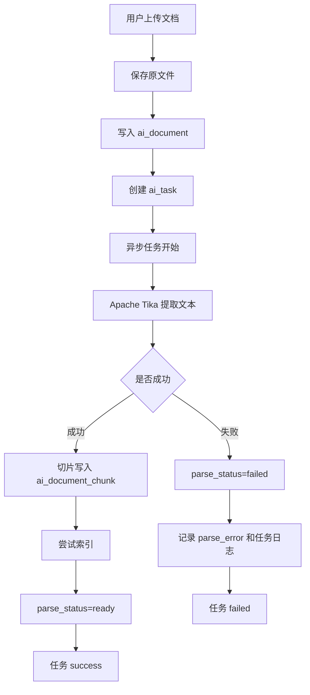

### 19.3 智能问答流程图

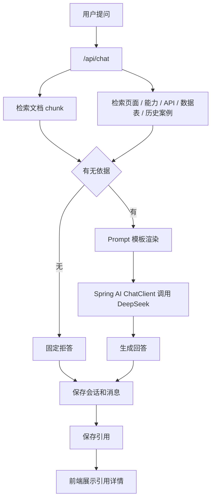

### 19.4 需求可行性分析流程图

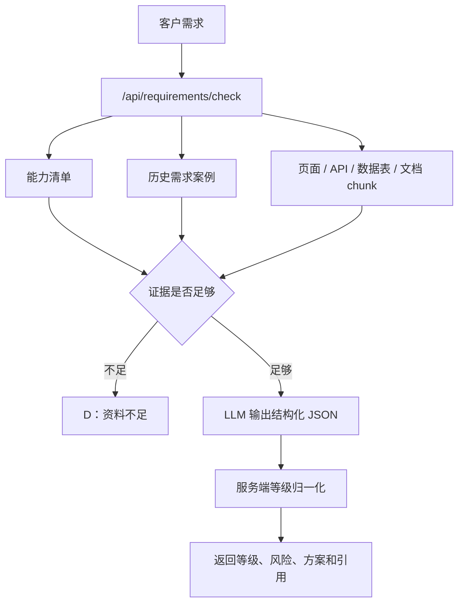

### 19.5 反馈转知识库流程图

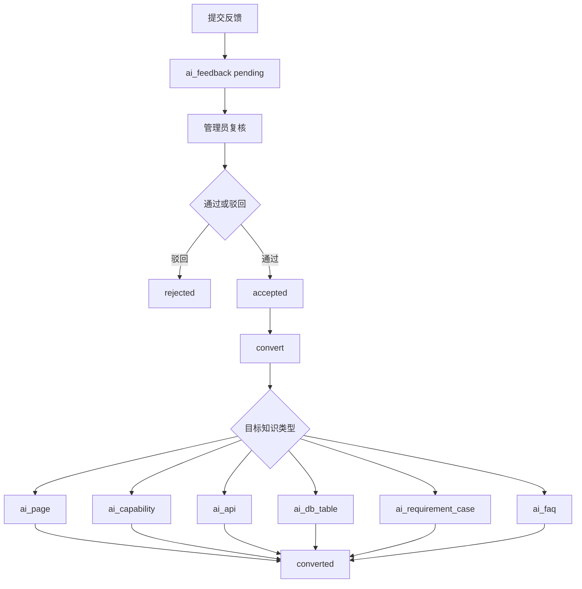

### 19.6 问答评测流程图

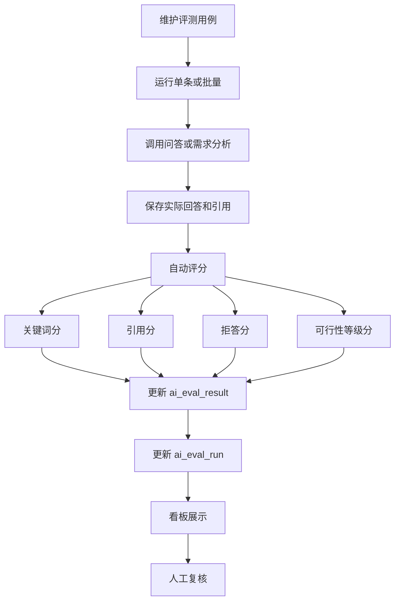

## 20. 整理依据

本文件基于以下当前项目文件和模块整理：

- `README.md`
- `docker-compose.yml`
- `.env.example`
- `docker/postgres/init.sql`
- `docker/postgres/seed-demo.sql`
- `database/init.sql`
- `backend/src/main/java/com/waterai/consultant/document`
- `backend/src/main/java/com/waterai/consultant/chat`
- `backend/src/main/java/com/waterai/consultant/requirement`
- `backend/src/main/java/com/waterai/consultant/retrieval`
- `backend/src/main/java/com/waterai/consultant/vector`
- `backend/src/main/java/com/waterai/consultant/task`
- `backend/src/main/java/com/waterai/consultant/eval`
- `backend/src/main/java/com/waterai/consultant/feedback`
- `backend/src/main/java/com/waterai/consultant/model`
- `backend/src/main/java/com/waterai/consultant/prompt`
- `backend/src/main/java/com/waterai/consultant/structured`
- `frontend/src/App.vue`
- `frontend/src/styles/main.css`
- `docs/config.md`
- `docs/api-overview.md`
- `docs/architecture.md`
- `docs/demo-guide.md`
